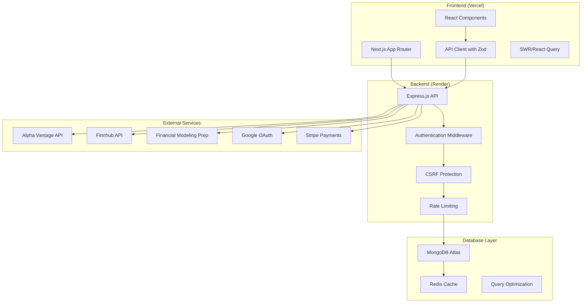
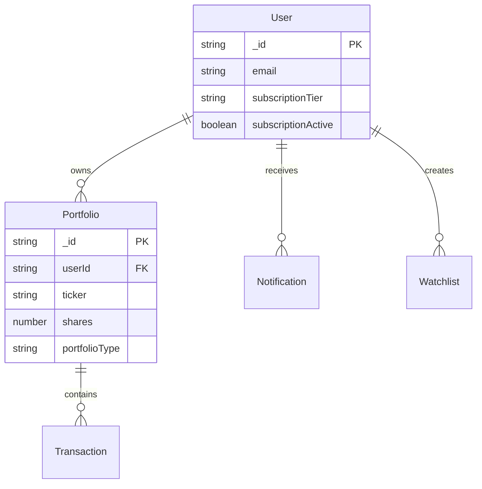
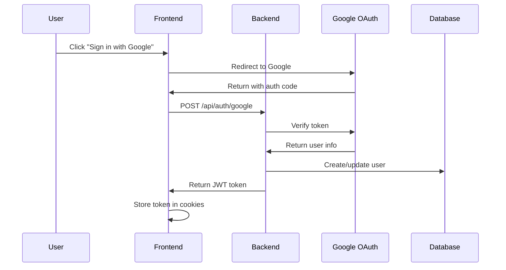
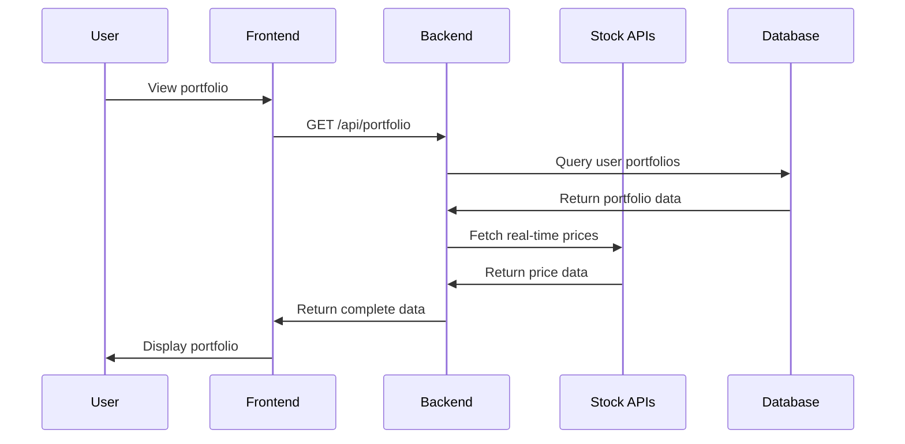
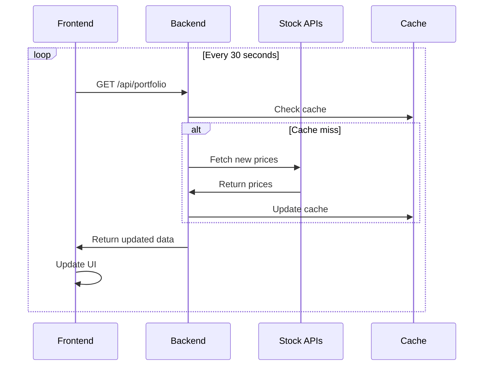
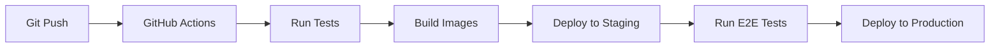

# 🏗️ AI Capital - System Architecture

**Last Updated:** October 15, 2025  
**Version:** 2.0

---

## 📋 Overview

AI Capital is a full-stack financial portfolio management application built with modern web technologies. The system provides real-time stock data, AI-powered investment decisions, and comprehensive portfolio analytics.

## 🎯 System Goals

- **Real-time Performance:** Sub-200ms API response times
- **High Availability:** 99.9% uptime target
- **Scalability:** Support 10,000+ concurrent users
- **Security:** Enterprise-grade security with CSRF, rate limiting, and validation
- **User Experience:** Intuitive, responsive interface across all devices

---

## 🏛️ High-Level Architecture



---

## 🖥️ Frontend Architecture

### Technology Stack
- **Framework:** Next.js 15 with App Router
- **Language:** TypeScript
- **Styling:** Tailwind CSS
- **State Management:** React Context + SWR
- **API Client:** Custom client with Zod validation
- **Authentication:** JWT tokens + Google OAuth

### Key Components

#### 1. **API Client (`lib/api.ts`)**
```typescript
// Centralized API client with type safety
export const api = new ApiClient();

// Usage in components
const { data, loading, error } = useApi(() => api.portfolio.getAll());
```

#### 2. **Custom Hooks (`hooks/useApi.ts`)**
```typescript
// Reusable hooks for common operations
export function usePortfolio(portfolioType?: string) {
  return useApi(() => api.portfolio.getAll({ portfolioType }));
}
```

#### 3. **Component Structure**
```
components/
├── ui/                 # Reusable UI components
├── OptimizedDashboard.tsx
├── PortfolioTable.tsx
├── NotificationPanel.tsx
└── Leaderboard.tsx
```

### Performance Optimizations
- **Code Splitting:** Dynamic imports for heavy components
- **Image Optimization:** Next.js Image component
- **Caching:** SWR for client-side caching
- **Bundle Analysis:** Webpack bundle analyzer
- **Lazy Loading:** Components loaded on demand

---

## ⚙️ Backend Architecture

### Technology Stack
- **Runtime:** Node.js 18+
- **Framework:** Express.js with TypeScript
- **Database:** MongoDB with Mongoose ODM
- **Caching:** Redis (optional)
- **Authentication:** JWT + Google OAuth
- **Security:** Helmet, CORS, CSRF, Rate Limiting
- **Logging:** Pino structured logging

### API Structure

#### 1. **Route Organization**
```
routes/
├── auth.ts           # Authentication endpoints
├── portfolio.ts      # Portfolio management
├── analytics.ts      # Performance analytics
├── notifications.ts  # Notification system
├── stripe.ts         # Payment processing
└── admin.ts          # Admin functions
```

#### 2. **Middleware Stack**
```typescript
// Request flow
Request → CORS → Rate Limiting → CSRF → Auth → Validation → Route Handler
```

#### 3. **Service Layer**
```
services/
├── stockDataService.ts      # Multi-provider stock data
├── decisionEngine.ts        # AI investment decisions
├── volatilityService.ts     # Risk calculations
├── reputationService.ts     # User scoring
└── queryBenchmark.ts        # Performance monitoring
```

### Database Design

#### 1. **Collections**
- **Users:** Authentication, subscription, preferences
- **Portfolios:** Stock holdings, transactions
- **Notifications:** User alerts and messages
- **Watchlist:** Price alerts and monitoring
- **AuditLogs:** Transaction history and changes

#### 2. **Indexes**
```javascript
// Performance-optimized indexes
PortfolioSchema.index({ userId: 1, portfolioType: 1 });
PortfolioSchema.index({ userId: 1, portfolioId: 1 });
PortfolioSchema.index({ ticker: 1 });
UserSchema.index({ email: 1 });
NotificationSchema.index({ userId: 1, isRead: 1 });
```

#### 3. **Data Relationships**


---

## 🔄 Data Flow

### 1. **User Authentication Flow**


### 2. **Portfolio Data Flow**


### 3. **Real-time Updates**


---

## 🔒 Security Architecture

### 1. **Authentication & Authorization**
- **JWT Tokens:** Stateless authentication
- **Google OAuth:** Social login integration
- **Role-based Access:** Admin, premium, free tiers
- **Session Management:** Secure cookie handling

### 2. **Request Security**
- **CSRF Protection:** Token-based CSRF prevention
- **Rate Limiting:** 300 requests/minute per IP
- **Input Validation:** Zod schema validation
- **SQL Injection:** Mongoose ODM protection
- **XSS Prevention:** Content Security Policy

### 3. **Data Security**
- **Encryption:** HTTPS everywhere
- **Sensitive Data:** Environment variables
- **API Keys:** Rotated and monitored
- **Audit Logging:** All actions tracked

---

## 📊 Performance Architecture

### 1. **Caching Strategy**
```typescript
// Multi-layer caching
Browser Cache → CDN Cache → Redis Cache → Database
```

### 2. **Database Optimization**
- **Indexes:** Optimized for common queries
- **Query Benchmarking:** Performance monitoring
- **Connection Pooling:** Efficient DB connections
- **Read Replicas:** Scale read operations

### 3. **API Optimization**
- **Response Compression:** Gzip compression
- **Pagination:** Large dataset handling
- **Batch Operations:** Multiple requests combined
- **Circuit Breaker:** Prevent cascade failures

---

## 🚀 Deployment Architecture

### 1. **Frontend (Vercel)**
- **Build:** Next.js static generation
- **CDN:** Global edge caching
- **Environment:** Production/staging
- **Monitoring:** Vercel Analytics

### 2. **Backend (Render)**
- **Runtime:** Node.js container
- **Database:** MongoDB Atlas
- **Cache:** Redis (optional)
- **Monitoring:** Render metrics

### 3. **CI/CD Pipeline**


---

## 📈 Monitoring & Observability

### 1. **Application Metrics**
- **Response Times:** API endpoint performance
- **Error Rates:** 4xx/5xx error tracking
- **Throughput:** Requests per second
- **Database:** Query performance

### 2. **Business Metrics**
- **User Engagement:** Active users, session duration
- **Feature Usage:** Most used features
- **Conversion:** Free to premium upgrades
- **Retention:** User churn rates

### 3. **Alerting**
- **Error Thresholds:** >5% error rate
- **Performance:** >500ms response time
- **Availability:** Service down alerts
- **Security:** Suspicious activity

---

## 🔧 Development Workflow

### 1. **Local Development**
```bash
# Backend
cd backend
npm install
npm run dev

# Frontend
cd frontend
npm install
npm run dev
```

### 2. **Testing Strategy**
- **Unit Tests:** Jest for business logic
- **Integration Tests:** API endpoint testing
- **E2E Tests:** Playwright for user flows
- **Performance Tests:** Load testing

### 3. **Code Quality**
- **TypeScript:** Type safety
- **ESLint:** Code linting
- **Prettier:** Code formatting
- **Husky:** Git hooks

---

## 🎯 Future Architecture Considerations

### 1. **Scaling Strategies**
- **Microservices:** Split into domain services
- **Event Sourcing:** CQRS pattern
- **Message Queues:** Async processing
- **Kubernetes:** Container orchestration

### 2. **Performance Improvements**
- **GraphQL:** Efficient data fetching
- **WebSockets:** Real-time updates
- **Service Workers:** Offline support
- **Edge Computing:** Reduce latency

### 3. **Feature Additions**
- **Mobile Apps:** React Native
- **AI/ML:** Advanced predictions
- **Blockchain:** Crypto integration
- **Social:** Community features

---

## 📚 Related Documentation

- [Data Providers](./DataProviders.md) - External API integrations
- [Decision Engine](./DecisionEngine.md) - AI scoring algorithm
- [Runbook](./Runbook.md) - Operations guide
- [API Reference](./API.md) - Endpoint documentation

---

**Last Updated:** October 15, 2025  
**Maintained by:** AI Capital Development Team