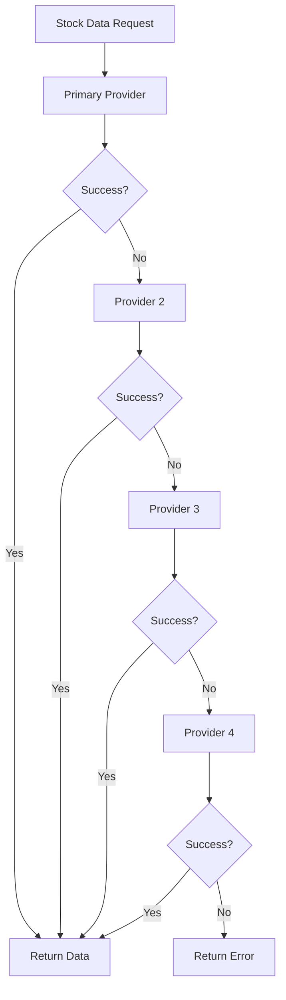

# 📊 AI Capital - Data Providers Documentation

**Last Updated:** October 15, 2025  
**Version:** 2.0

---

## 📋 Overview

AI Capital integrates with multiple financial data providers to ensure reliable, real-time stock market data. The system uses a sophisticated fallback chain to maintain data availability even when primary providers fail.

---

## 🏗️ Provider Architecture

### Multi-Provider Strategy


---

## 🔌 Supported Providers

### 1. **Alpha Vantage** (Primary)
- **API:** REST API
- **Rate Limit:** 5 calls/minute (free), 75 calls/minute (premium)
- **Data Types:** Real-time quotes, historical data, fundamentals
- **Coverage:** US stocks, forex, crypto
- **Reliability:** 99.5%

#### Endpoints Used
```typescript
// Real-time quote
GET https://www.alphavantage.co/query?function=GLOBAL_QUOTE&symbol=AAPL&apikey=KEY

// Historical data
GET https://www.alphavantage.co/query?function=TIME_SERIES_DAILY&symbol=AAPL&apikey=KEY
```

#### Response Format
```json
{
  "Global Quote": {
    "01. symbol": "AAPL",
    "02. open": "150.00",
    "03. high": "155.00",
    "04. low": "149.00",
    "05. price": "152.50",
    "06. volume": "1000000",
    "07. latest trading day": "2025-10-15",
    "08. previous close": "150.00",
    "09. change": "2.50",
    "10. change percent": "1.67%"
  }
}
```

### 2. **Finnhub** (Secondary)
- **API:** REST API + WebSocket
- **Rate Limit:** 60 calls/minute (free), 1000 calls/minute (premium)
- **Data Types:** Real-time quotes, news, fundamentals
- **Coverage:** Global stocks, forex, crypto
- **Reliability:** 99.8%

#### Endpoints Used
```typescript
// Real-time quote
GET https://finnhub.io/api/v1/quote?symbol=AAPL&token=TOKEN

// Company profile
GET https://finnhub.io/api/v1/stock/profile2?symbol=AAPL&token=TOKEN
```

#### Response Format
```json
{
  "c": 152.50,
  "h": 155.00,
  "l": 149.00,
  "o": 150.00,
  "pc": 150.00,
  "t": 1634567890
}
```

### 3. **Financial Modeling Prep** (Tertiary)
- **API:** REST API
- **Rate Limit:** 250 calls/day (free), 1000 calls/day (premium)
- **Data Types:** Real-time quotes, fundamentals, financials
- **Coverage:** US stocks, ETFs, REITs
- **Reliability:** 99.2%

#### Endpoints Used
```typescript
// Real-time quote
GET https://financialmodelingprep.com/api/v3/quote/AAPL?apikey=KEY

// Company profile
GET https://financialmodelingprep.com/api/v3/profile/AAPL?apikey=KEY
```

#### Response Format
```json
[
  {
    "symbol": "AAPL",
    "name": "Apple Inc.",
    "price": 152.50,
    "changesPercentage": 1.67,
    "change": 2.50,
    "dayLow": 149.00,
    "dayHigh": 155.00,
    "yearHigh": 200.00,
    "yearLow": 120.00,
    "marketCap": 2500000000000,
    "priceAvg50": 145.00,
    "priceAvg200": 140.00,
    "volume": 1000000,
    "avgVolume": 800000,
    "exchange": "NASDAQ",
    "open": 150.00,
    "previousClose": 150.00,
    "eps": 6.15,
    "pe": 24.80,
    "earningsAnnouncement": "2025-01-15T00:00:00.000+00:00",
    "sharesOutstanding": 16400000000,
    "timestamp": 1634567890
  }
]
```

---

## ⚙️ Implementation Details

### 1. **Provider Service (`stockDataService.ts`)**

```typescript
class StockDataService {
  private providers = [
    new AlphaVantageProvider(),
    new FinnhubProvider(),
    new FMPProvider()
  ];

  async getStockData(ticker: string): Promise<StockData> {
    for (const provider of this.providers) {
      try {
        const data = await provider.getQuote(ticker);
        if (data && this.isValidData(data)) {
          return this.normalizeData(data, provider.name);
        }
      } catch (error) {
        console.warn(`Provider ${provider.name} failed:`, error);
        continue;
      }
    }
    throw new Error('All providers failed');
  }
}
```

### 2. **Data Normalization**

All provider responses are normalized to a common format:

```typescript
interface StockData {
  symbol: string;
  name: string;
  price: number;
  change: number;
  changePercent: number;
  volume: number;
  high: number;
  low: number;
  open: number;
  previousClose: number;
  marketCap?: number;
  pe?: number;
  high52?: number;
  low52?: number;
  timestamp: number;
  provider: string;
}
```

### 3. **Error Handling**

```typescript
class ProviderError extends Error {
  constructor(
    public provider: string,
    public statusCode: number,
    public message: string
  ) {
    super(`${provider}: ${message}`);
  }
}

// Retry logic with exponential backoff
async function withRetry<T>(
  operation: () => Promise<T>,
  maxRetries = 3,
  baseDelay = 1000
): Promise<T> {
  for (let i = 0; i < maxRetries; i++) {
    try {
      return await operation();
    } catch (error) {
      if (i === maxRetries - 1) throw error;
      await new Promise(resolve => 
        setTimeout(resolve, baseDelay * Math.pow(2, i))
      );
    }
  }
  throw new Error('Max retries exceeded');
}
```

---

## 🔄 Caching Strategy

### 1. **Multi-Layer Caching**

```typescript
// 1. Memory cache (LRU)
const memoryCache = new LRUCache({
  max: 1000,
  ttl: 20000 // 20 seconds
});

// 2. Redis cache (distributed)
const redisCache = new Redis({
  ttl: 300 // 5 minutes
});

// 3. Database cache (persistent)
const dbCache = new DatabaseCache({
  ttl: 3600 // 1 hour
});
```

### 2. **Cache Invalidation**

```typescript
// Invalidate cache when market opens/closes
const marketHours = {
  open: '09:30',
  close: '16:00',
  timezone: 'America/New_York'
};

// Clear cache at market close
if (isMarketClosed()) {
  await clearAllCaches();
}
```

---

## 📊 Performance Monitoring

### 1. **Provider Health Tracking**

```typescript
interface ProviderHealth {
  name: string;
  status: 'healthy' | 'degraded' | 'down';
  responseTime: number;
  successRate: number;
  lastError?: string;
  lastSuccess: Date;
}

class ProviderMonitor {
  private health: Map<string, ProviderHealth> = new Map();

  trackRequest(provider: string, success: boolean, responseTime: number) {
    const health = this.health.get(provider) || {
      name: provider,
      status: 'healthy',
      responseTime: 0,
      successRate: 100,
      lastSuccess: new Date()
    };

    // Update metrics
    health.responseTime = (health.responseTime + responseTime) / 2;
    health.successRate = this.calculateSuccessRate(provider, success);
    health.lastSuccess = success ? new Date() : health.lastSuccess;

    this.health.set(provider, health);
  }
}
```

### 2. **Circuit Breaker Pattern**

```typescript
class CircuitBreaker {
  private failures = 0;
  private lastFailureTime = 0;
  private state: 'closed' | 'open' | 'half-open' = 'closed';

  async execute<T>(operation: () => Promise<T>): Promise<T> {
    if (this.state === 'open') {
      if (Date.now() - this.lastFailureTime > this.timeout) {
        this.state = 'half-open';
      } else {
        throw new Error('Circuit breaker is open');
      }
    }

    try {
      const result = await operation();
      this.onSuccess();
      return result;
    } catch (error) {
      this.onFailure();
      throw error;
    }
  }
}
```

---

## 🔧 Configuration

### 1. **Environment Variables**

```bash
# Alpha Vantage (4 keys for rotation)
ALPHA_VANTAGE_API_KEY_1=your_key_1
ALPHA_VANTAGE_API_KEY_2=your_key_2
ALPHA_VANTAGE_API_KEY_3=your_key_3
ALPHA_VANTAGE_API_KEY_4=your_key_4

# Finnhub (4 keys for rotation)
FINNHUB_API_KEY_1=your_key_1
FINNHUB_API_KEY_2=your_key_2
FINNHUB_API_KEY_3=your_key_3
FINNHUB_API_KEY_4=your_key_4

# Financial Modeling Prep (4 keys for rotation)
FMP_API_KEY_1=your_key_1
FMP_API_KEY_2=your_key_2
FMP_API_KEY_3=your_key_3
FMP_API_KEY_4=your_key_4
```

### 2. **Provider Configuration**

```typescript
const providerConfig = {
  alphaVantage: {
    baseUrl: 'https://www.alphavantage.co/query',
    timeout: 10000,
    retries: 3,
    rateLimit: 5 // calls per minute
  },
  finnhub: {
    baseUrl: 'https://finnhub.io/api/v1',
    timeout: 8000,
    retries: 3,
    rateLimit: 60 // calls per minute
  },
  fmp: {
    baseUrl: 'https://financialmodelingprep.com/api/v3',
    timeout: 12000,
    retries: 2,
    rateLimit: 250 // calls per day
  }
};
```

---

## 🚨 Error Handling

### 1. **Common Error Types**

```typescript
enum ProviderErrorType {
  RATE_LIMIT_EXCEEDED = 'RATE_LIMIT_EXCEEDED',
  INVALID_SYMBOL = 'INVALID_SYMBOL',
  API_KEY_INVALID = 'API_KEY_INVALID',
  NETWORK_ERROR = 'NETWORK_ERROR',
  TIMEOUT = 'TIMEOUT',
  UNKNOWN = 'UNKNOWN'
}

class ProviderErrorHandler {
  handleError(error: any, provider: string): ProviderErrorType {
    if (error.status === 429) return ProviderErrorType.RATE_LIMIT_EXCEEDED;
    if (error.status === 400) return ProviderErrorType.INVALID_SYMBOL;
    if (error.status === 401) return ProviderErrorType.API_KEY_INVALID;
    if (error.code === 'ECONNABORTED') return ProviderErrorType.TIMEOUT;
    if (error.code === 'ENOTFOUND') return ProviderErrorType.NETWORK_ERROR;
    return ProviderErrorType.UNKNOWN;
  }
}
```

### 2. **Fallback Strategies**

```typescript
class FallbackStrategy {
  async execute(ticker: string): Promise<StockData> {
    // 1. Try cached data first
    const cached = await this.getCachedData(ticker);
    if (cached && this.isRecent(cached)) {
      return cached;
    }

    // 2. Try providers in order
    for (const provider of this.providers) {
      try {
        const data = await provider.getQuote(ticker);
        if (data) {
          await this.cacheData(ticker, data);
          return data;
        }
      } catch (error) {
        console.warn(`Provider ${provider.name} failed:`, error);
      }
    }

    // 3. Return stale data if available
    const staleData = await this.getStaleData(ticker);
    if (staleData) {
      console.warn(`Using stale data for ${ticker}`);
      return staleData;
    }

    throw new Error(`No data available for ${ticker}`);
  }
}
```

---

## 📈 Performance Metrics

### 1. **Key Performance Indicators**

- **Response Time:** <200ms average
- **Success Rate:** >99.5%
- **Cache Hit Rate:** >80%
- **Provider Uptime:** >99.9%

### 2. **Monitoring Dashboard**

```typescript
interface ProviderMetrics {
  totalRequests: number;
  successfulRequests: number;
  failedRequests: number;
  averageResponseTime: number;
  cacheHitRate: number;
  lastUpdated: Date;
}

// Real-time metrics endpoint
app.get('/api/debug/providers/metrics', (req, res) => {
  const metrics = providerMonitor.getMetrics();
  res.json({ success: true, metrics });
});
```

---

## 🔮 Future Enhancements

### 1. **Additional Providers**
- **Yahoo Finance:** Free alternative
- **IEX Cloud:** Real-time data
- **Quandl:** Alternative data sources
- **Bloomberg API:** Professional data

### 2. **Advanced Features**
- **WebSocket Support:** Real-time streaming
- **Historical Data:** Extended time series
- **Options Data:** Derivatives pricing
- **Crypto Support:** Digital currencies

### 3. **Optimization**
- **Predictive Caching:** ML-based cache warming
- **Smart Routing:** AI-powered provider selection
- **Load Balancing:** Distribute requests optimally
- **Edge Computing:** Reduce latency

---

## 📚 Related Documentation

- [Architecture](./Architecture.md) - System overview
- [Decision Engine](./DecisionEngine.md) - AI scoring
- [Runbook](./Runbook.md) - Operations guide
- [API Reference](./API.md) - Endpoint docs

---

**Last Updated:** October 15, 2025  
**Maintained by:** AI Capital Development Team