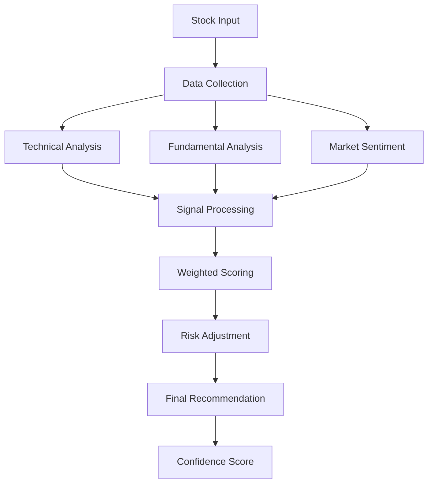

# 🧠 AI Capital - Decision Engine Documentation

**Last Updated:** October 15, 2025  
**Version:** 2.0

---

## 📋 Overview

The AI Capital Decision Engine is a sophisticated algorithm that analyzes multiple financial signals to provide intelligent BUY/HOLD/SELL recommendations for stocks. The system combines technical analysis, fundamental metrics, and market sentiment to generate actionable investment advice.

---

## 🎯 Core Philosophy

### Investment Principles
1. **Data-Driven Decisions:** All recommendations based on quantitative analysis
2. **Risk-Adjusted Returns:** Prioritize risk management over pure returns
3. **Market Efficiency:** Adapt to changing market conditions
4. **User-Centric:** Tailor recommendations to user's risk tolerance

### Scoring Methodology
- **Scale:** 0-100 points
- **Thresholds:** 
  - 0-30: Strong SELL
  - 31-45: SELL
  - 46-55: HOLD
  - 56-70: BUY
  - 71-100: Strong BUY

---

## 🏗️ Architecture

### Decision Engine Flow


---

## 📊 Signal Analysis

### 1. **Technical Analysis Signals**

#### Price Momentum (Weight: 25%)
```typescript
interface PriceMomentum {
  rsi: number;           // Relative Strength Index
  macd: number;          // MACD Signal
  sma20: number;         // 20-day Simple Moving Average
  sma50: number;         // 50-day Simple Moving Average
  sma200: number;        // 200-day Simple Moving Average
  bollingerPosition: number; // Position in Bollinger Bands
}

function calculatePriceMomentum(data: PriceMomentum): number {
  let score = 50; // Base score
  
  // RSI analysis (0-100)
  if (data.rsi < 30) score += 20; // Oversold
  else if (data.rsi > 70) score -= 20; // Overbought
  else if (data.rsi > 40 && data.rsi < 60) score += 10; // Neutral
  
  // MACD analysis
  if (data.macd > 0) score += 15; // Bullish
  else score -= 15; // Bearish
  
  // Moving average trends
  if (data.sma20 > data.sma50 && data.sma50 > data.sma200) score += 20;
  else if (data.sma20 < data.sma50 && data.sma50 < data.sma200) score -= 20;
  
  return Math.max(0, Math.min(100, score));
}
```

#### Volume Analysis (Weight: 15%)
```typescript
interface VolumeAnalysis {
  currentVolume: number;
  averageVolume: number;
  volumeTrend: 'increasing' | 'decreasing' | 'stable';
  priceVolumeCorrelation: number;
}

function calculateVolumeScore(data: VolumeAnalysis): number {
  let score = 50;
  
  // Volume vs average
  const volumeRatio = data.currentVolume / data.averageVolume;
  if (volumeRatio > 1.5) score += 20; // High volume
  else if (volumeRatio < 0.5) score -= 15; // Low volume
  
  // Volume trend
  if (data.volumeTrend === 'increasing') score += 15;
  else if (data.volumeTrend === 'decreasing') score -= 10;
  
  // Price-volume correlation
  if (data.priceVolumeCorrelation > 0.7) score += 10;
  else if (data.priceVolumeCorrelation < -0.3) score -= 10;
  
  return Math.max(0, Math.min(100, score));
}
```

#### Volatility Analysis (Weight: 10%)
```typescript
interface VolatilityAnalysis {
  currentVolatility: number;
  historicalVolatility: number;
  volatilityPercentile: number; // 0-100
  beta: number;
}

function calculateVolatilityScore(data: VolatilityAnalysis): number {
  let score = 50;
  
  // Volatility percentile (lower is better for stability)
  if (data.volatilityPercentile < 25) score += 20; // Low volatility
  else if (data.volatilityPercentile > 75) score -= 15; // High volatility
  
  // Beta analysis
  if (data.beta < 0.8) score += 15; // Less volatile than market
  else if (data.beta > 1.2) score -= 10; // More volatile than market
  
  return Math.max(0, Math.min(100, score));
}
```

### 2. **Fundamental Analysis Signals**

#### Financial Health (Weight: 20%)
```typescript
interface FinancialHealth {
  peRatio: number;
  pegRatio: number;
  debtToEquity: number;
  currentRatio: number;
  roe: number; // Return on Equity
  roa: number; // Return on Assets
  profitMargin: number;
}

function calculateFinancialHealth(data: FinancialHealth): number {
  let score = 50;
  
  // P/E Ratio analysis
  if (data.peRatio > 0 && data.peRatio < 15) score += 20; // Undervalued
  else if (data.peRatio > 25) score -= 20; // Overvalued
  else if (data.peRatio > 15 && data.peRatio < 25) score += 5; // Fair value
  
  // PEG Ratio (Price/Earnings to Growth)
  if (data.pegRatio > 0 && data.pegRatio < 1) score += 15; // Undervalued
  else if (data.pegRatio > 2) score -= 15; // Overvalued
  
  // Debt to Equity
  if (data.debtToEquity < 0.3) score += 15; // Low debt
  else if (data.debtToEquity > 1) score -= 20; // High debt
  
  // Current Ratio (liquidity)
  if (data.currentRatio > 2) score += 10; // Good liquidity
  else if (data.currentRatio < 1) score -= 15; // Poor liquidity
  
  // Profitability
  if (data.roe > 15) score += 15; // High ROE
  else if (data.roe < 5) score -= 10; // Low ROE
  
  if (data.roa > 10) score += 10; // High ROA
  else if (data.roa < 3) score -= 5; // Low ROA
  
  return Math.max(0, Math.min(100, score));
}
```

#### Growth Potential (Weight: 15%)
```typescript
interface GrowthPotential {
  revenueGrowth: number; // YoY revenue growth
  earningsGrowth: number; // YoY earnings growth
  marketCap: number;
  sectorGrowth: number;
  analystEstimates: {
    priceTarget: number;
    currentPrice: number;
    recommendation: 'buy' | 'hold' | 'sell';
  };
}

function calculateGrowthScore(data: GrowthPotential): number {
  let score = 50;
  
  // Revenue growth
  if (data.revenueGrowth > 20) score += 25; // High growth
  else if (data.revenueGrowth > 10) score += 15; // Moderate growth
  else if (data.revenueGrowth < 0) score -= 20; // Declining revenue
  
  // Earnings growth
  if (data.earningsGrowth > 25) score += 20; // High earnings growth
  else if (data.earningsGrowth > 10) score += 10; // Moderate growth
  else if (data.earningsGrowth < 0) score -= 15; // Declining earnings
  
  // Analyst recommendations
  if (data.analystEstimates.recommendation === 'buy') score += 15;
  else if (data.analystEstimates.recommendation === 'sell') score -= 15;
  
  // Price target vs current price
  const upside = (data.analystEstimates.priceTarget - data.analystEstimates.currentPrice) / data.analystEstimates.currentPrice;
  if (upside > 0.2) score += 10; // 20%+ upside
  else if (upside < -0.1) score -= 10; // 10%+ downside
  
  return Math.max(0, Math.min(100, score));
}
```

### 3. **Market Sentiment Signals**

#### Market Conditions (Weight: 10%)
```typescript
interface MarketConditions {
  marketTrend: 'bull' | 'bear' | 'sideways';
  vix: number; // Volatility Index
  sectorPerformance: number; // Relative sector performance
  marketCap: 'large' | 'mid' | 'small';
}

function calculateMarketSentiment(data: MarketConditions): number {
  let score = 50;
  
  // Market trend
  if (data.marketTrend === 'bull') score += 15;
  else if (data.marketTrend === 'bear') score -= 15;
  
  // VIX analysis (fear gauge)
  if (data.vix < 20) score += 10; // Low fear
  else if (data.vix > 30) score -= 10; // High fear
  
  // Sector performance
  if (data.sectorPerformance > 0.1) score += 10; // Outperforming sector
  else if (data.sectorPerformance < -0.1) score -= 10; // Underperforming sector
  
  // Market cap preference (during different market conditions)
  if (data.marketTrend === 'bull' && data.marketCap === 'small') score += 5;
  else if (data.marketTrend === 'bear' && data.marketCap === 'large') score += 5;
  
  return Math.max(0, Math.min(100, score));
}
```

#### News Sentiment (Weight: 5%)
```typescript
interface NewsSentiment {
  sentimentScore: number; // -1 to 1
  newsCount: number;
  recentNews: Array<{
    sentiment: 'positive' | 'negative' | 'neutral';
    impact: 'high' | 'medium' | 'low';
    timestamp: Date;
  }>;
}

function calculateNewsSentiment(data: NewsSentiment): number {
  let score = 50;
  
  // Overall sentiment
  if (data.sentimentScore > 0.3) score += 20; // Positive sentiment
  else if (data.sentimentScore < -0.3) score -= 20; // Negative sentiment
  
  // Recent high-impact news
  const recentHighImpact = data.recentNews.filter(
    news => news.impact === 'high' && 
    Date.now() - news.timestamp.getTime() < 7 * 24 * 60 * 60 * 1000 // Last 7 days
  );
  
  const positiveNews = recentHighImpact.filter(news => news.sentiment === 'positive').length;
  const negativeNews = recentHighImpact.filter(news => news.sentiment === 'negative').length;
  
  if (positiveNews > negativeNews) score += 10;
  else if (negativeNews > positiveNews) score -= 10;
  
  return Math.max(0, Math.min(100, score));
}
```

---

## ⚖️ Weighted Scoring Algorithm

### Final Score Calculation
```typescript
interface DecisionEngineInput {
  technical: {
    priceMomentum: PriceMomentum;
    volumeAnalysis: VolumeAnalysis;
    volatilityAnalysis: VolatilityAnalysis;
  };
  fundamental: {
    financialHealth: FinancialHealth;
    growthPotential: GrowthPotential;
  };
  sentiment: {
    marketConditions: MarketConditions;
    newsSentiment: NewsSentiment;
  };
  userProfile: {
    riskTolerance: 'conservative' | 'moderate' | 'aggressive';
    investmentHorizon: 'short' | 'medium' | 'long';
    portfolioSize: number;
  };
}

function calculateFinalScore(input: DecisionEngineInput): {
  score: number;
  recommendation: 'BUY' | 'HOLD' | 'SELL';
  confidence: number;
  reasoning: string[];
} {
  // Calculate individual signal scores
  const priceMomentumScore = calculatePriceMomentum(input.technical.priceMomentum);
  const volumeScore = calculateVolumeScore(input.technical.volumeAnalysis);
  const volatilityScore = calculateVolatilityScore(input.technical.volatilityAnalysis);
  const financialHealthScore = calculateFinancialHealth(input.fundamental.financialHealth);
  const growthScore = calculateGrowthScore(input.fundamental.growthPotential);
  const marketSentimentScore = calculateMarketSentiment(input.sentiment.marketConditions);
  const newsSentimentScore = calculateNewsSentiment(input.sentiment.newsSentiment);
  
  // Apply weights
  const weightedScore = 
    (priceMomentumScore * 0.25) +
    (volumeScore * 0.15) +
    (volatilityScore * 0.10) +
    (financialHealthScore * 0.20) +
    (growthScore * 0.15) +
    (marketSentimentScore * 0.10) +
    (newsSentimentScore * 0.05);
  
  // Risk adjustment based on user profile
  const riskAdjustedScore = applyRiskAdjustment(weightedScore, input.userProfile);
  
  // Generate recommendation
  const recommendation = generateRecommendation(riskAdjustedScore);
  
  // Calculate confidence
  const confidence = calculateConfidence([
    priceMomentumScore,
    volumeScore,
    volatilityScore,
    financialHealthScore,
    growthScore,
    marketSentimentScore,
    newsSentimentScore
  ]);
  
  // Generate reasoning
  const reasoning = generateReasoning({
    priceMomentumScore,
    volumeScore,
    volatilityScore,
    financialHealthScore,
    growthScore,
    marketSentimentScore,
    newsSentimentScore
  });
  
  return {
    score: Math.round(riskAdjustedScore),
    recommendation,
    confidence: Math.round(confidence),
    reasoning
  };
}
```

### Risk Adjustment
```typescript
function applyRiskAdjustment(score: number, userProfile: UserProfile): number {
  let adjustedScore = score;
  
  // Conservative users: Prefer stability over growth
  if (userProfile.riskTolerance === 'conservative') {
    // Reduce score for high-volatility stocks
    if (score > 70) adjustedScore = score * 0.9;
    // Increase score for stable, dividend-paying stocks
    if (score < 50 && score > 30) adjustedScore = score * 1.1;
  }
  
  // Aggressive users: Prefer growth over stability
  else if (userProfile.riskTolerance === 'aggressive') {
    // Increase score for high-growth potential
    if (score > 60) adjustedScore = Math.min(100, score * 1.1);
    // Reduce score for overly conservative picks
    if (score < 40) adjustedScore = score * 0.9;
  }
  
  // Investment horizon adjustment
  if (userProfile.investmentHorizon === 'short') {
    // Favor technical signals over fundamental
    adjustedScore = score * 0.8 + (score * 0.2);
  } else if (userProfile.investmentHorizon === 'long') {
    // Favor fundamental signals over technical
    adjustedScore = score * 0.6 + (score * 0.4);
  }
  
  return Math.max(0, Math.min(100, adjustedScore));
}
```

---

## 🎯 Recommendation Generation

### Recommendation Logic
```typescript
function generateRecommendation(score: number): 'BUY' | 'HOLD' | 'SELL' {
  if (score >= 71) return 'BUY';
  if (score >= 56) return 'BUY';
  if (score >= 46) return 'HOLD';
  if (score >= 31) return 'SELL';
  return 'SELL';
}

function calculateConfidence(scores: number[]): number {
  // Calculate standard deviation to measure consensus
  const mean = scores.reduce((sum, score) => sum + score, 0) / scores.length;
  const variance = scores.reduce((sum, score) => sum + Math.pow(score - mean, 2), 0) / scores.length;
  const standardDeviation = Math.sqrt(variance);
  
  // Lower standard deviation = higher confidence
  const confidence = Math.max(0, 100 - (standardDeviation * 2));
  return confidence;
}
```

### Reasoning Generation
```typescript
function generateReasoning(scores: {
  priceMomentumScore: number;
  volumeScore: number;
  volatilityScore: number;
  financialHealthScore: number;
  growthScore: number;
  marketSentimentScore: number;
  newsSentimentScore: number;
}): string[] {
  const reasoning: string[] = [];
  
  // Price momentum reasoning
  if (scores.priceMomentumScore > 70) {
    reasoning.push('Strong bullish momentum with positive technical indicators');
  } else if (scores.priceMomentumScore < 30) {
    reasoning.push('Bearish momentum with negative technical indicators');
  }
  
  // Volume reasoning
  if (scores.volumeScore > 70) {
    reasoning.push('High trading volume supporting price movement');
  } else if (scores.volumeScore < 30) {
    reasoning.push('Low trading volume may indicate weak conviction');
  }
  
  // Financial health reasoning
  if (scores.financialHealthScore > 70) {
    reasoning.push('Strong financial fundamentals with healthy balance sheet');
  } else if (scores.financialHealthScore < 30) {
    reasoning.push('Weak financial fundamentals raise concerns');
  }
  
  // Growth potential reasoning
  if (scores.growthScore > 70) {
    reasoning.push('Strong growth potential with positive earnings outlook');
  } else if (scores.growthScore < 30) {
    reasoning.push('Limited growth potential with declining fundamentals');
  }
  
  // Market sentiment reasoning
  if (scores.marketSentimentScore > 70) {
    reasoning.push('Favorable market conditions supporting the investment');
  } else if (scores.marketSentimentScore < 30) {
    reasoning.push('Challenging market conditions may impact performance');
  }
  
  return reasoning;
}
```

---

## 📊 Performance Tracking

### Backtesting Framework
```typescript
interface BacktestResult {
  period: string;
  totalTrades: number;
  winningTrades: number;
  losingTrades: number;
  winRate: number;
  averageReturn: number;
  totalReturn: number;
  maxDrawdown: number;
  sharpeRatio: number;
  accuracy: number; // How often recommendations were correct
}

class BacktestEngine {
  async runBacktest(
    startDate: Date,
    endDate: Date,
    symbols: string[]
  ): Promise<BacktestResult> {
    const results: BacktestResult[] = [];
    
    for (const symbol of symbols) {
      const historicalData = await this.getHistoricalData(symbol, startDate, endDate);
      const recommendations = await this.generateHistoricalRecommendations(historicalData);
      const performance = this.calculatePerformance(recommendations, historicalData);
      results.push(performance);
    }
    
    return this.aggregateResults(results);
  }
}
```

### A/B Testing
```typescript
class ABTestEngine {
  async runABTest(
    testName: string,
    variants: DecisionEngineVariant[],
    duration: number
  ): Promise<ABTestResult> {
    // Split users into test groups
    const groups = this.splitUsers(variants.length);
    
    // Run test for specified duration
    const results = await this.collectResults(groups, duration);
    
    // Analyze statistical significance
    return this.analyzeResults(results);
  }
}
```

---

## 🔧 Configuration & Tuning

### Signal Weights Configuration
```typescript
interface SignalWeights {
  priceMomentum: number;
  volumeAnalysis: number;
  volatilityAnalysis: number;
  financialHealth: number;
  growthPotential: number;
  marketConditions: number;
  newsSentiment: number;
}

const DEFAULT_WEIGHTS: SignalWeights = {
  priceMomentum: 0.25,
  volumeAnalysis: 0.15,
  volatilityAnalysis: 0.10,
  financialHealth: 0.20,
  growthPotential: 0.15,
  marketConditions: 0.10,
  newsSentiment: 0.05
};

// Dynamic weight adjustment based on market conditions
function adjustWeightsForMarketConditions(
  weights: SignalWeights,
  marketCondition: 'bull' | 'bear' | 'sideways'
): SignalWeights {
  const adjusted = { ...weights };
  
  if (marketCondition === 'bear') {
    // In bear markets, emphasize fundamental analysis
    adjusted.financialHealth *= 1.2;
    adjusted.growthPotential *= 0.8;
  } else if (marketCondition === 'bull') {
    // In bull markets, emphasize momentum
    adjusted.priceMomentum *= 1.1;
    adjusted.volumeAnalysis *= 1.1;
  }
  
  return adjusted;
}
```

---

## 🚀 Future Enhancements

### 1. **Machine Learning Integration**
- **Neural Networks:** Deep learning for pattern recognition
- **Ensemble Methods:** Combine multiple ML models
- **Reinforcement Learning:** Learn from trading outcomes
- **Natural Language Processing:** Analyze news sentiment

### 2. **Advanced Analytics**
- **Monte Carlo Simulation:** Risk scenario analysis
- **Options Pricing:** Derivatives analysis
- **Sector Rotation:** Market cycle analysis
- **Correlation Analysis:** Portfolio diversification

### 3. **Real-time Adaptation**
- **Dynamic Rebalancing:** Adjust weights in real-time
- **Market Regime Detection:** Identify market phases
- **Volatility Forecasting:** Predict future volatility
- **Sentiment Tracking:** Real-time news analysis

---

## 📚 Related Documentation

- [Architecture](./Architecture.md) - System overview
- [Data Providers](./DataProviders.md) - Data sources
- [Runbook](./Runbook.md) - Operations guide
- [API Reference](./API.md) - Endpoint documentation

---

**Last Updated:** October 15, 2025  
**Maintained by:** AI Capital Development Team